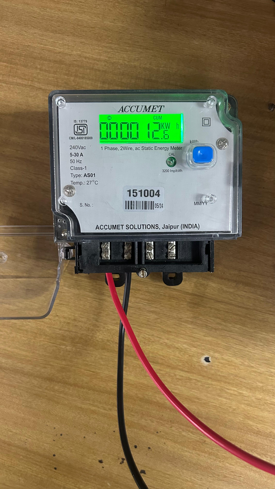
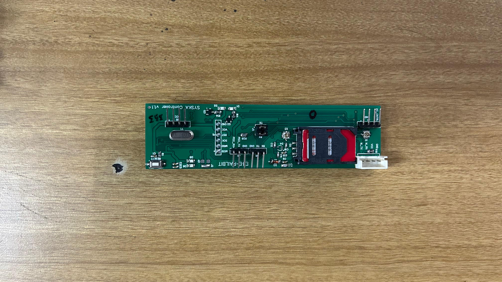
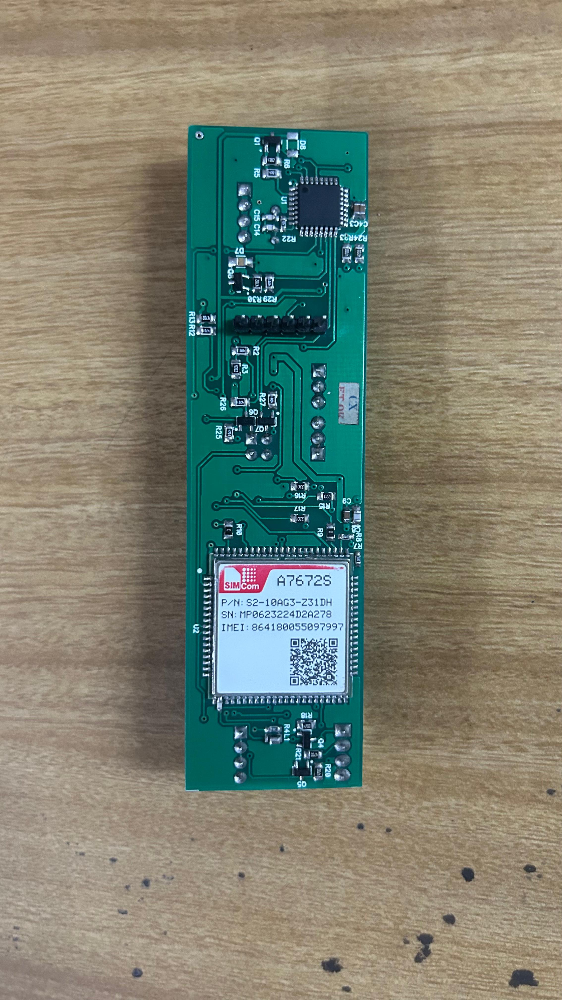

# Smart Energy Dashboard - Complete Setup Guide

### 0. Hardware setup
Energy meter

ATmega328PB

Simcom Module



### 1. Project Structure Setup

Create your project directory and organize files as follows:

```
smart-energy-dashboard/
├── backend/
│   ├── app.py                     # [asset:2]  
│   ├── database.py                # [asset:3]
│   ├── config.py                  # [asset:4]
│   └── requirements.txt           # [asset:8]
│
├── dashboard/
│   ├── app.py                     # [asset:5]
│   ├── utils.py                   # [asset:6]  
│   ├── pages/
│   │   ├── 1_📊_Live_Dashboard.py # [asset:7]
│   │   └── 2_🧾_Raw_Data_Log.py   # [asset:11]
│   ├── .streamlit/
│   │   └── config.toml            # [asset:10]
│   └── requirements.txt           # [asset:9]
│
├── scripts/
│   ├── start_backend.py           # [asset:12]
│   └── start_dashboard.py         # [asset:13]
│
├── data/                          # Auto-created
│   ├── meter_data.db             # Auto-created SQLite DB
│   └── logs/                     # Auto-created log directory
│
└── README.md                     # This file
```

### 2. Installation Steps

#### Step 1: Clone/Download Project Files
```bash
# Create project directory
mkdir smart-energy-dashboard
cd smart-energy-dashboard

# Create subdirectories
mkdir -p backend dashboard/pages dashboard/.streamlit scripts data/logs
```

#### Step 2: Install Backend (Flask API Server)
```bash
cd backend

# Create virtual environment
python -m venv venv

# Activate virtual environment
# On Windows:
venv\Scripts\activate
# On macOS/Linux:
source venv/bin/activate

# Install dependencies
pip install -r requirements.txt
```

#### Step 3: Install Dashboard (Streamlit)
```bash
cd ../dashboard

# Create virtual environment
python -m venv venv

# Activate virtual environment  
# On Windows:
venv\Scripts\activate
# On macOS/Linux:
source venv/bin/activate

# Install dependencies
pip install -r requirements.txt
```

### 3. Running the System

#### Method 1: Using Startup Scripts (Recommended)
```bash
# Start backend server
python scripts/start_backend.py

# In a new terminal, start dashboard
python scripts/start_dashboard.py
```

#### Method 2: Manual Startup
```bash
# Terminal 1: Start Flask Backend
cd backend
python app.py

# Terminal 2: Start Streamlit Dashboard  
cd dashboard
streamlit run app.py
```

### 4. Access Points

Once both services are running:

- ** Flask API**: http://localhost:8080
- ** Dashboard**: http://localhost:8501
- ** Health Check**: http://localhost:8080/health
- ** Test Endpoint**: http://localhost:8080/test

### 5. IoT Device Integration

Your ATmega328PB device should send data to:
```
GET http://localhost:8080/meter?v=230.5&c=8.750&pf=0.92&l=2.01560&k=1250.75&f=50.2&d=26-07-2025%2013:05:30&r=0&s=atmega328pb
```

**Parameter mapping:**
- `v` = voltage (V)
- `c` = current (A)  
- `pf` = power factor
- `l` = load (kW)
- `k` = kWh total
- `f` = frequency (Hz)
- `d` = datetime
- `r` = retry count
- `s` = source device

### 6. Features Overview

#### 🔌 Flask Backend Features:
-  Auto-creates SQLite database and tables
-  Real-time data validation and storage
-  RESTful API endpoints for data access
-  CSV export functionality
-  System health monitoring
-  Comprehensive logging
-  Error handling and recovery

#### 📊 Dashboard Features:
-  Real-time energy metrics display
-  Carbon footprint calculations
-  Interactive historical charts
-  Multi-device support
-  Data quality monitoring
-  Export capabilities (CSV)
-  Auto-refresh functionality
-  Green eco-friendly theme

### 7. Database Schema

The system automatically creates the following SQLite tables:

```sql
-- Main data table
CREATE TABLE meter_readings (
    id INTEGER PRIMARY KEY AUTOINCREMENT,
    voltage REAL,
    current REAL,
    power_factor REAL,
    load_kw REAL,
    kwh REAL,
    frequency REAL,
    datetime_str TEXT,
    retry_count INTEGER DEFAULT 0,
    source TEXT,
    received_at TEXT NOT NULL,
    created_at TIMESTAMP DEFAULT CURRENT_TIMESTAMP
);

-- Device status tracking
CREATE TABLE device_status (
    id INTEGER PRIMARY KEY AUTOINCREMENT,
    source TEXT NOT NULL UNIQUE,
    last_seen TIMESTAMP,
    status TEXT DEFAULT 'online',
    boot_count INTEGER DEFAULT 0,
    error_count INTEGER DEFAULT 0
);

-- System logs
CREATE TABLE system_logs (
    id INTEGER PRIMARY KEY AUTOINCREMENT,
    level TEXT NOT NULL,
    message TEXT NOT NULL,
    module TEXT,
    timestamp TIMESTAMP DEFAULT CURRENT_TIMESTAMP
);
```

### 8. API Endpoints

#### Data Collection:
- `GET/POST /meter` - Receive meter data
- `GET /health` - System health check
- `GET /test` - Test endpoint with sample data

#### Data Access:
- `GET /api/data` - Retrieve stored readings (JSON)
- `GET /api/export` - Export data as CSV
- `GET /api/stats` - Database statistics

### 9. Configuration

#### Environment Variables (.env file):
```bash
# Flask Settings
FLASK_ENV=development
FLASK_HOST=0.0.0.0
FLASK_PORT=8080

# Database
DATABASE_PATH=data/meter_data.db

# Logging
LOG_LEVEL=INFO
LOG_FILE=data/logs/flask_app.log

# Carbon Footprint
EMISSION_FACTOR=0.82
```

### 10. Troubleshooting

#### Common Issues:

1. **Database not found**
   - The system auto-creates the database on first run
   - Ensure the `data/` directory exists

2. **Port already in use**
   - Change ports in config files if 8080/8501 are occupied
   - Kill existing processes: `lsof -ti:8080 | xargs kill`

3. **Dashboard shows no data**
   - Ensure Flask backend is running
   - Check if IoT device is sending data
   - Verify API endpoint: http://localhost:8080/health

4. **Permission errors**
   - Ensure write permissions for `data/` directory
   - Run with appropriate user privileges

### 11. Production Deployment

#### Using Gunicorn (Flask):
```bash
cd backend
gunicorn -w 4 -b 0.0.0.0:8080 app:app
```

#### Using Docker:
```dockerfile
# Example Dockerfile for Flask backend
FROM python:3.9-slim
WORKDIR /app
COPY backend/ .
RUN pip install -r requirements.txt
EXPOSE 8080
CMD ["python", "app.py"]
```

### 12. Monitoring & Maintenance

- **Logs**: Check `data/logs/flask_app.log` for issues
- **Database**: Located at `data/meter_data.db`
- **Backup**: Regular database backups recommended
- **Cleanup**: Old data cleanup configurable (default: 30 days)

### 13. Support & Development

#### Project Info:
- **Developer**: Rhythm Kachhwaha
- **Tech Stack**: ATmega328PB + SIMCOM A7672S + Flask + SQLite3 + Streamlit
- **License**: Open Source
- **Version**: 1.0.0

#### Contact & Issues:
- Submit issues or feature requests
- Contributions welcome
- Documentation updates appreciated

---

## 🌟 System Ready!

Your complete smart energy dashboard system is now ready to monitor and analyze energy consumption from your IoT smart meter with real-time carbon footprint calculations!
